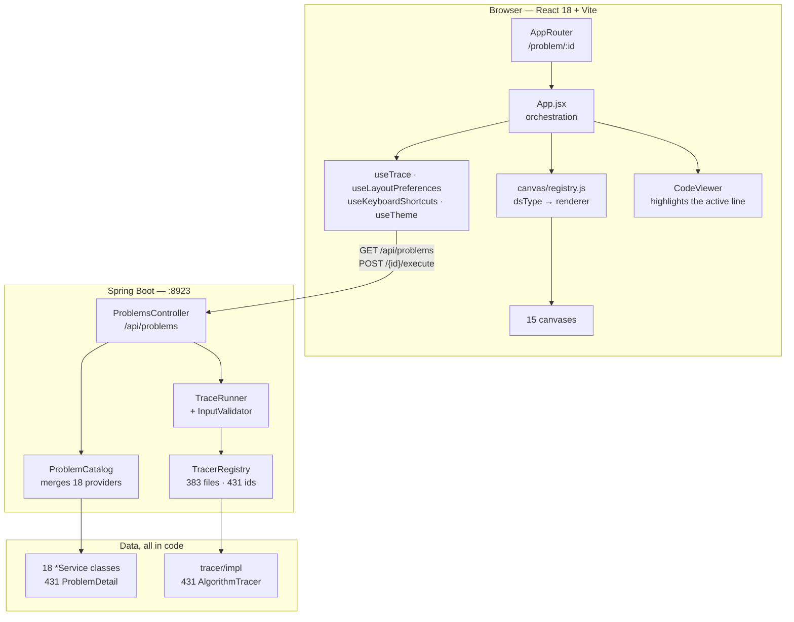
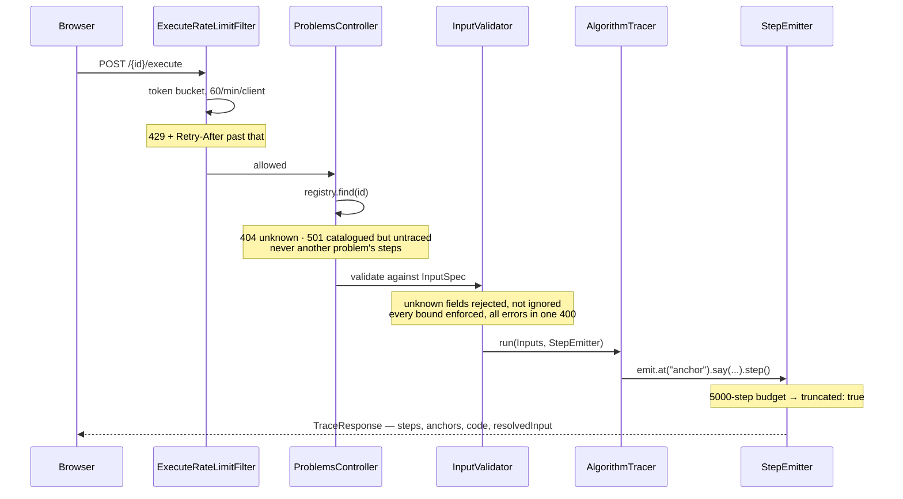
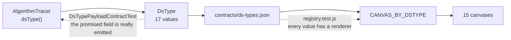
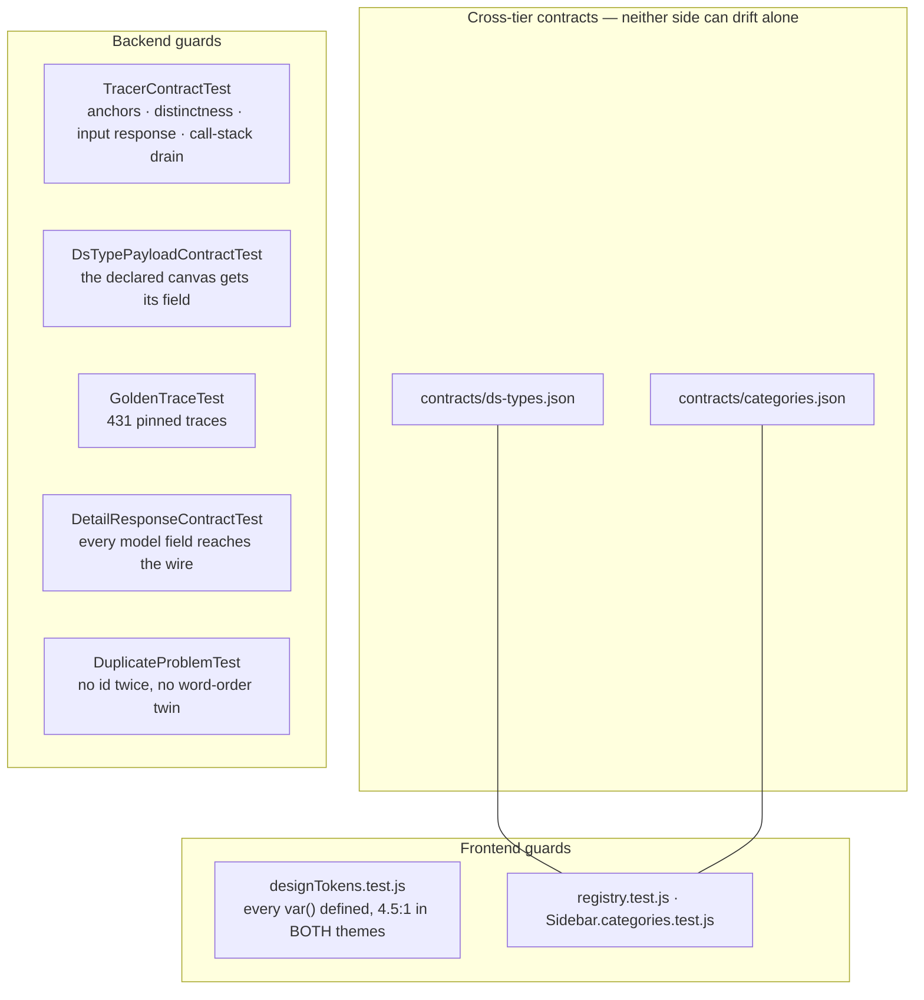

# Architecture

> **Every number here is read from the running system, not from another document.**
> Regenerate them with `curl -s localhost:8923/api/problems/stats`. If a figure below
> disagrees with that endpoint, the endpoint is right.
>
> Verified 2026-09-13: **431 problems, 431 traced, 0 untraced, 0 duplicate ids, 17 topics.**

## The shape of it

One Spring Boot service, one React bundle, no database. Everything served is computed from
code: the catalogue is built at startup from eighteen provider classes, and every animation
is produced by running the real algorithm on demand.



**There is no persistence layer, and none is needed.** No user data, no writes, no sessions.
The only per-user state is `localStorage` in the browser: theme, playback speed, which
panels are open, whether the welcome has been seen.

## The request that matters

`POST /api/problems/{id}/execute` is the only expensive call — it runs a real algorithm on
caller-supplied input. Everything guarding the system guards this path.



Two caps are mandatory rather than optional, and both exist because a caller setting `n = 20`
on a factorial-time problem could otherwise take the server down: a **per-field size ceiling**
in the `InputSpec`, and a **global step budget** (5000).

## The tracer contract

The load-bearing idea. A tracer cannot be written without declaring how it is to be checked.

```java
public interface AlgorithmTracer {
    String id();                              // "kadane-algo"
    DsType dsType();                          // closed canvas vocabulary
    InputSpec inputSpec();                    // declared inputs, bounds, defaults
    Map<String, Object> alternateInput();     // a MATERIALLY different input
    String annotatedCode();                   // Java source carrying // @a anchors
    void run(Inputs in, StepEmitter emit);    // executes the algorithm for real
}
```

`alternateInput()` is abstract so it cannot be skipped, and it is what makes
`traceRespondsToItsInput` possible: run every tracer on two different inputs and fail if the
traces match. **A canned narration cannot survive that**, which is the whole point — the
original incident was 303 problems returning another algorithm's trace under 90 green tests
whose only per-problem assertion was `!steps.isEmpty()`.

`annotatedCode()` carries `// @a name` markers rather than line numbers, because a line
number drifts the moment the displayed code changes. `AnnotatedCode` resolves names to
numbers, strips the markers, and rejects duplicate, unnamed or dangling anchors.

## Routing a trace to a picture

`dsType` is a closed backend enum. It selects the canvas, and a contract test on each side
stops the two tiers drifting.



| dsType | n | Canvas | What the picture is *for* |
|---|---:|---|---|
| `Array` | 68 | ArrayCanvas | values and pointers |
| `DpTable` | 54 | DpTableCanvas | the table filling, with arrows from each dependency |
| `Tree` | 54 | TreeCanvas | structure and traversal order |
| `Graph` | 40 | GraphCanvas | topology and frontier |
| `LinkedList` | 36 | LinkedListCanvas | nodes, next/child/random links |
| `Matrix` | 31 | GridCanvas | the board |
| `SearchSpace` | 27 | SearchSpaceCanvas | the space **halving** — index or answer space |
| `String` | 26 | ArrayCanvas | characters and pointers |
| `Stack` | 25 | StackCanvas | what is on the stack |
| `RecursionTree` | 19 | RecursionTreeCanvas | the tree explored, rebuilt from `callStack` |
| `PriorityQueue` | 16 | HeapCanvas | the heap as **tree and array at once** |
| `Bits` | 12 | ArrayCanvas | bit positions |
| `Window` | 12 | WindowCanvas | the window **moving and stretching** |
| `Queue` | 4 | QueueCanvas | what is queued |
| `Dsu` | 3 | DsuCanvas | parent/rank tables and components |
| `Interval` | 2 | IntervalCanvas | spans on a timeline |
| `Trie` | 2 | TrieCanvas | the prefix tree |

Several canvases **derive** what a tracer did not emit, rather than demanding tracer changes:
`RecursionTreeCanvas` rebuilds the tree from call stacks, `HeapCanvas` derives whichever of
the tree or array is missing, `WindowCanvas` finds the window from cell states. Derivation is
preferred because it cannot drift from the trace — it is computed from it.

## What holds it together

The rule this codebase is organised around: **no fallback, anywhere.** An unknown id is 404,
a catalogued-but-untraced one is 501, an unknown `dsType` renders an explicit unsupported
state, and a canvas with no data says so rather than inventing a plausible default.



Golden files pin trace **content** — the descriptions, variables and highlighted lines —
which every other test is blind to. Regenerating one without reading the diff records a bug
as expected; see `CLAUDE.md`.

## Scale

The bottleneck is CPU, not storage, because `/execute` runs real algorithms.

- `/api/problems` is served from a cached projection with a **weak** ETag and gzip:
  236 KB → 31 KB, then 304 on revalidation. (The ETag must stay weak — Tomcat refuses to
  compress a response carrying a strong one. `HttpCachingTest` pins this.)
- `/execute` is capped per client at 60/min, per request at 5000 steps.
- The app is stateless, so it scales horizontally. **One caveat:** rate-limit buckets are
  in-memory, so N instances enforce N × the limit. That is the first thing needing Redis.

Not yet done, in rough order of value: caching traces for default inputs (most traffic is
"open a problem, press play", recomputing the same 431 traces), serving the bundle from a
CDN, and structured logging plus timing on `TraceRunner` — there is no observability today.

## Where things live

| Path | What |
|---|---|
| `backend/src/main/java/com/dsa/ui/tracer/` | the contract, the runner, the validator |
| `backend/src/main/java/com/dsa/ui/tracer/impl/` | 383 files, 431 tracers |
| `backend/src/main/java/com/dsa/ui/service/` | 18 catalogue providers — **not dead code**, they hold every `ProblemDetail` |
| `backend/src/main/java/com/dsa/ui/catalog/` | `ProblemCatalog`, `ProblemConstraints` |
| `backend/src/test/resources/golden/` | 431 pinned traces |
| `frontend/src/canvas/registry.js` | the only dsType→renderer table |
| `frontend/src/trace/` | delta decoding, recursion-tree and heap derivation |
| `contracts/` | the two cross-tier fixtures |

## Related reading

`CLAUDE.md` — working rules and the tracer how-to. `RCA.md` — incident ledger; read it
before changing an affected subsystem. `AUDIT.md` — the full per-problem audit.
`REVIEW.md` — the six review gates every change goes through.
