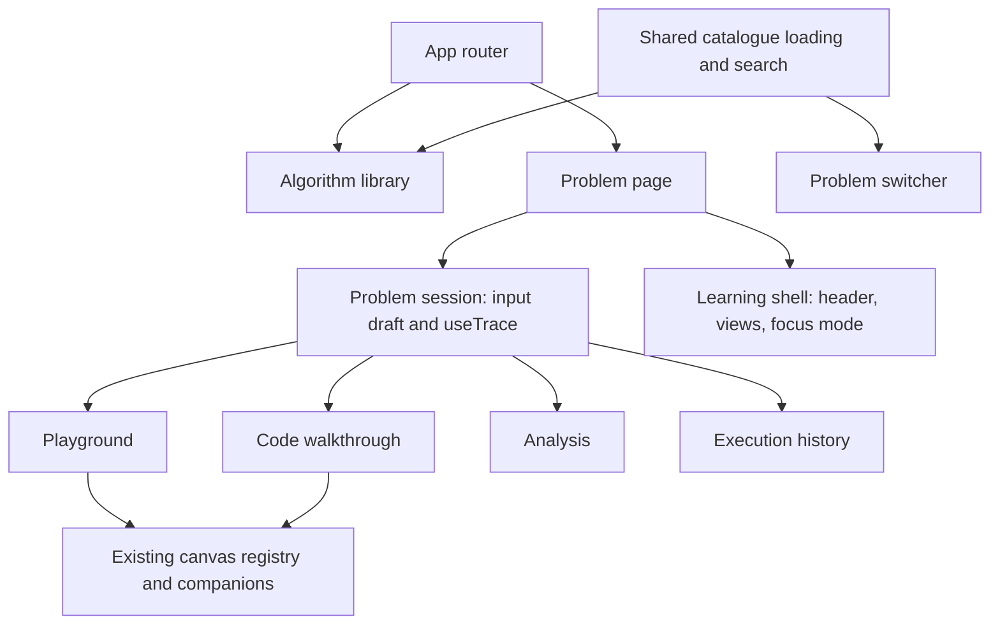

# Frontend architecture and migration

Status: proposed, 2026-09-23. Keep React 18, JavaScript/JSX, React Router, Vite, the current Java API, and existing renderers. Do not combine this redesign with a framework or language migration.

## 1. Boundaries

The diagram shows ownership, not simultaneous mounts. Render a single active primary canvas; do not mount three live copies just to preserve state. Preserve state above the views instead.

## 2. Proposed component responsibilities

| Component/module | Responsibility |
| --- | --- |
| AppRouter | Library/problem/not-found routes; preserves existing problem path |
| AppShell / ThemeProvider | Brand/navigation, skip link, validated preference storage, document theme |
| AlgorithmLibrary | URL-backed filters, result continuation, return navigation |
| ProblemPage | Resolves problem ID, hosts the stable problem session, sets page title |
| LearningShell | Header, accessible view tabs, panel layout, focus mode |
| ProblemSwitcher | Modal/focus behavior; reuses search engine and result presentation |
| ProblemSession / hook | Owns trace hook, draft, submitted-input snapshot, run status, and view-independent state |
| VisualizationStage | Existing CanvasShell, registry dispatch, companions, contained error boundary |
| PlaybackBar | One controller interface shared by the active view |
| CodePanel | Java display, line tracking, manual-scroll/follow preference |
| InputEditor | Controlled schema-derived fields and validation; existing field editors reused |
| AnalysisPanel | Variables, call stack, data structure contents, complexity explanations |
| ExecutionHistory | Capture disclosure plus bounded textual step navigation |
| Catalogue hook/provider | Fetch/cache state, deduplication, retry, request cancellation, normalized entries |

Create abstractions when the reference slice needs them. Names may change; responsibilities and state boundaries should not. A single new component containing all routing, fetch, rendering, search, and layout logic would reproduce the current coupling.

## 3. State ownership and persistence

| State | Owner | Survives view change | Survives problem change | Survives refresh |
| --- | --- | --- | --- | --- |
| Catalogue and fetch status | Application catalogue provider | Yes | Yes | Refetched |
| Library query/filters | URL | Yes | Yes through return navigation | Yes |
| Library loaded batch/scroll | Library history entry/session cache | Yes | Restored on Back | Optional; filters still restored |
| Selected problem | URL path | Yes | Replaced explicitly | Yes |
| Selected learning view | URL query | Yes | Default Playground for switcher selection | Yes |
| Draft input and field errors | Problem session | Yes | Reset for new problem | No promise |
| Submitted input snapshot/run steps | Problem session/useTrace | Yes | Replaced | Default run fetched |
| Current step/speed | Problem session/useTrace | Yes | Step resets; speed may remain preference | Speed preference only |
| Playing state | Problem session/useTrace | Paused on explicit view change | Paused | Paused |
| Theme, code split, split ratio | Validated preference adapter | Yes | Yes | Yes if storage works |
| Focus mode, open modal | Shell | Focus mode exits on view change | Reset | No |
| Source follow/manual-scroll state | Problem session or panel state keyed by problem | Yes | Reset | No promise |

Limit preferences to known values and bounded numeric ranges. Existing `dsa:recentSearches` remains compatible. New preferences use a versioned key or versioned object with safe parsing; denied/quota-exhausted storage falls back to memory.

Do not persist full traces or raw input by default. Persistence of arbitrary drafts or cross-problem run restoration is deferred. The UI must not promise those capabilities.

## 4. Trace integrity

Continue using `useTrace` for Java detail/default execution, custom input execution, cancellation, stale-response rejection, trace decoding, seek, and playback. Refactor incrementally with existing integration tests intact.

The backend owns algorithm behavior, code-anchor mapping, input validation, state snapshots, and complexity metadata. The frontend owns presentation, input drafts, and selecting already-returned steps. It must not synthesize a successful run, infer missing semantic state from titles, or substitute another algorithm.

Keep the last valid run separately from request state when implementing validation/network failure recovery. Any visible previous run must retain its input snapshot and an explicit previous-result status. A newly submitted draft cannot become the displayed run's identity until execution succeeds.

Opening a switcher, changing views, hiding the document, or switching problems pauses playback. Resuming always requires explicit Play. Component unmount clears playback timers and cancels/supersedes fetches. No duplicate timer may be introduced by mounting multiple playback bars.

The default run's input snapshot is derived from the matching input specification/defaults, or labeled as backend defaults if the exact values are not available. Never imply an editable draft was the input for an earlier run.

## 5. Routes and navigation

| Route | Behavior |
| --- | --- |
| `/` | Library with optional filter query parameters |
| `/problem/:id` | Default Playground for the problem |
| `/problem/:id?view=code` | Code walkthrough |
| `/problem/:id?view=analysis` | Analysis |
| Unknown route | Helpful not-found page with library link |
| Unknown problem ID | Explicit unknown-problem state after catalogue/detail resolution; do not silently execute Two Sum |

Use replace navigation for tab changes so Back exits the problem rather than walking every tab selection. Use ordinary push navigation for opening a different problem. Preserve unrelated valid query parameters when selecting a view. Invalid `view` values normalize to Playground.

Library queries are URL-backed; debounce/replace typing updates as appropriate. Opening a problem creates a history entry. Direct entry to a problem still offers a working All algorithms link. Do not set global document scrolling to hidden except while a modal is open, and always restore it on dismissal/unmount.

## 6. Catalogue and search extraction

Extract the existing single-endpoint catalogue fetch from `App` into a shared application owner. Fetch once per application load and on explicit retry rather than per selected problem. Preserve deduplication and honest offline catalogue labeling.

Reuse `scoreProblem`, matching helpers, normalization, and recent-search logic. Split result computation from display limits. The library needs continuation beyond 50; the switcher may intentionally show a bounded top-results list with a View all results action carrying its query.

Do not eagerly fetch detail or execution for every catalogue entry. A library page should not execute Two Sum in the background just because the old App default selected it.

## 7. Styling and sizing

Use scoped CSS modules for new shell/layout styles and global semantic tokens for the shared visual vocabulary. Remove the old fixed root-height and bottom-row assumptions only when their replacement is integrated. Remove dead classes after consumers are migrated; avoid a permanent layer of increasingly specific overrides.

Canvas wrappers supply explicit useful dimensions and bounded overflow. If a renderer measures its container, observe real container resizing, including code-pane changes and tab activation. Hidden panels must not cache zero-sized geometry. Preserve existing backend layout coordinates unless a proven display issue requires a renderer adaptation.

Retain execution-state token names where possible so canvas semantics and contrast tests remain stable. If a token changes, update its documented role and verify every consumer in both themes. HLD's styling is a reference, not a CSS file to import across repositories.

## 8. Migration sequence

1. Record baseline and acceptance inventory before changing the active routes.
2. Add foundational tokens/components and a development-only reference harness or isolated route for review. Do not expose incomplete navigation as the default.
3. Extract catalogue/session ownership with behavioral tests, keeping the legacy shell runnable during the transition.
4. Build the library and reference workspace for Array, Graph+Queue, and 2D DP.
5. Verify state preservation, custom inputs, error recovery, direct links, and responsive layouts.
6. Route the main application through the replacement once the integration gate passes.
7. Adapt remaining renderer families, complete quality review, then remove obsolete layout code and the development-only route.

Prefer reviewable commits and focused PRs. Do not leave two public interfaces indefinitely. Do not publish or merge merely because local implementation is complete; follow the session's delivery authorization.

Rollback is a normal revert of the frontend integration change. No API migration, database change, or destructive preference migration is required. Record the integration commit and any independently needed fixes so a rollback is reviewable.

## 9. Dependencies and deferred changes

Use the existing dependency set for initial implementation. Browser automation may justify a development-only Playwright dependency during the quality phase; this is proposed and is not currently an existing project command. Record installation, browser requirements, and CI cost before introducing it.

Do not add a state-management, animation, diagram-editing, or component-library dependency without a specific unmet requirement. A full design-system migration is outside scope. A new library must earn its maintenance and accessibility cost.

## 10. Technical review checklist

- Session state is above conditional views; drafts and selected step survive.
- Detail/spec arrival initializes only the correct untouched draft.
- Stale requests cannot replace newer selections or submitted runs.
- Only one primary canvas and one playback timer are active.
- Search shortcuts have one owner and no duplicate result IDs.
- Route changes and modal unmount restore focus/scroll locks.
- No fabricated code, result, complexity, or unavailable visualization.
- Existing tests retain their semantic assertions even when selectors/navigation change.
- Server contracts remain unchanged unless a separately documented requirement demands otherwise.
